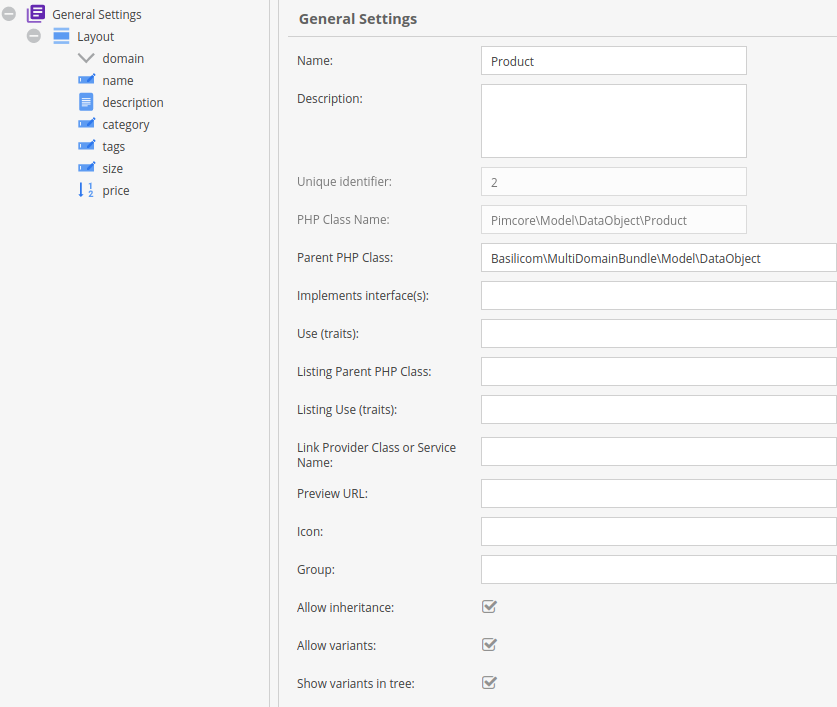
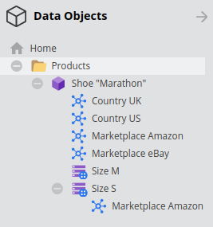
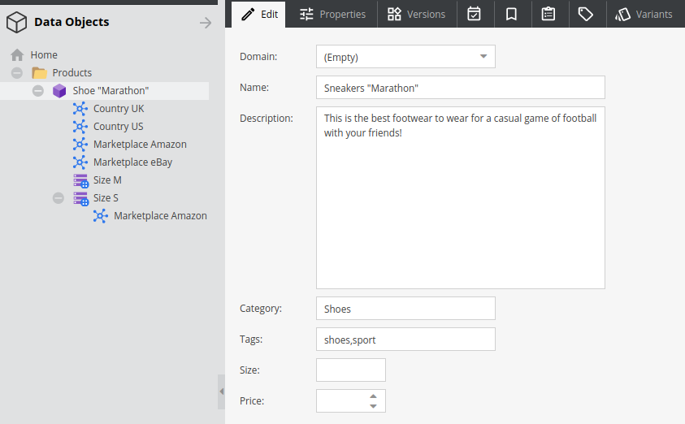
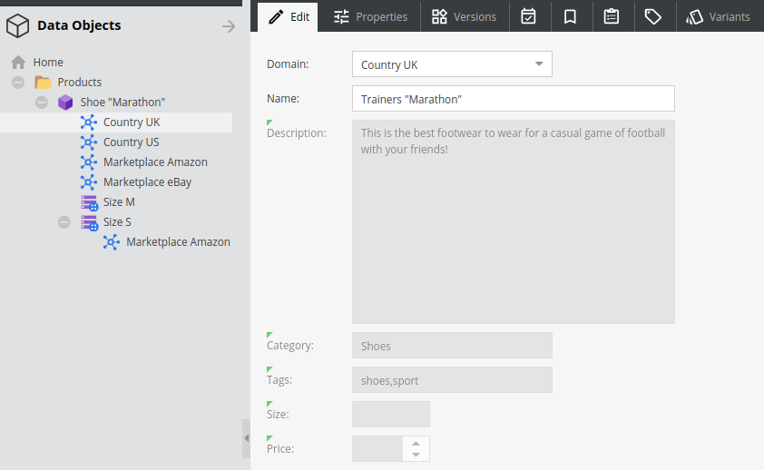
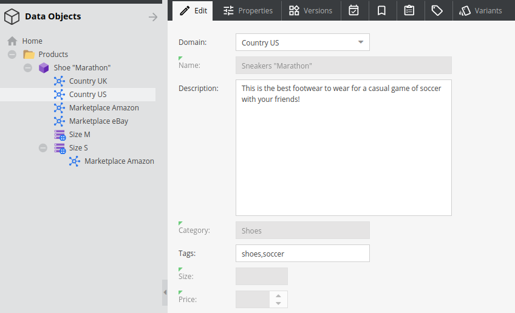
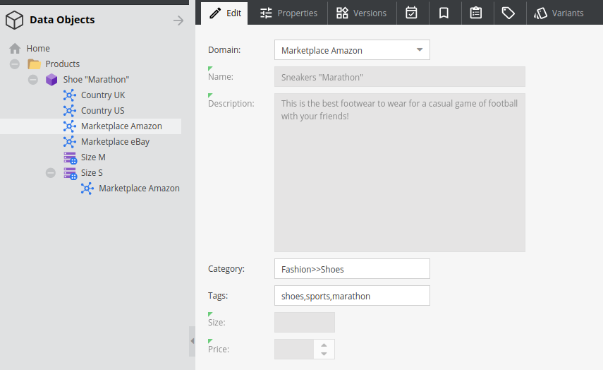
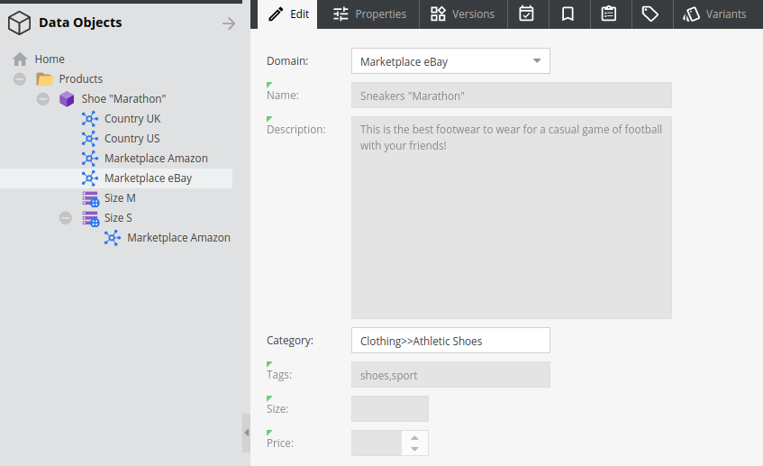
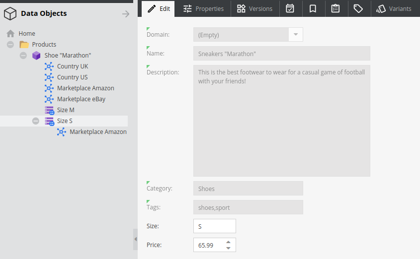
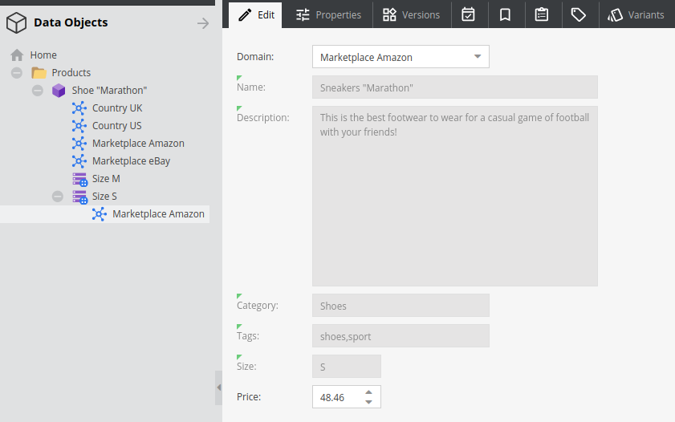

# Basilicom Multi Domain bundle for Pimcore

Adds functionality to work with multi-dimensional
domain specific attributes in Pimcore objects.
   
On a technical level, it allows an object variant to
have _multiple_ parents for inheritance. This is achieved
by dynamically re-writing the variant inheritance parent
lookup by injecting domain specific variant _siblings_ instead.

The order of domain selection determines the domain variant
precedence.    

Furthermore, variants can have domain variants as childs, which
are able to _override_ already specified field values in
regular variants (see demo data below, "Amazon" domain
variant for "Size S").

This bundle contains an AdminStyle extension, in order
to change the variant icon to a "mind-map" icon and
provide special quicktips on hover, too.

Glossary:
* **Domain Variant** - an object variant, where the ```domain``` field is NOT empty
* **Domain Sibling** - a domain variant next to a regular variant object, 
  providing domain specific value inheritance fallback
* **Domain Child**  - an domain variant as child of a regular variant object, 
  _overriding_ regular variant values

**WARNING: WORK IN PROGRESS - CONTAINS DEBUG CODE!**

## License

GPLv3 - see: gpl-3.0.txt

## Requirements

* Pimcore >= 6.0.0

## Installation

1) Install the bundle using composer `composer require basilicom/multi-domain-bundle dev-master`.
2) Execute `bin/console pimcore:bundle:enable BasilicomMultiDomainBundle`

## Configuration

* Add a field named `domain` to the class to enable multi domain capabilities 
  for. This can be any field type, which get() method resolves into a string.
  Usually, choose a select field.
* Configure the class to use Basilicom\MultiDomainBundle\Model\DataObject
  as "Parent PHP Class".
  
Example:


### Usage

Use objects and variants (variant hierarchies) as usually.
Add variants as childs to an object or a variant and set the
`domain` field to some value (not null) in order to configure
a domain specific variant.

Get domain specific object value as usually, but select
any number of domains beforehand:

```php
use Basilicom\MultiDomainBundle\Service\Domain;

$object = \Pimcore\Model\DataObject\AbstractObject::getByPath('/my-object');

// select two domain contexts, first to contain a value override wins!
Domain::select(['Country US','Marketplace eBay']);

$fieldValue = $object->getMyFieldName();

// reset selected domain; normal pimcore behaviour:
Domain::clear(); 
```

If you retrieve an object and you want to know if it
is a domain variant, just use: ```$myObject->isDomainVariant()```

### Samples

Given the following object/variant setup:



With object and/or variants set up like:

















You get the following data for the various domain selections:

| Case        | Product        | Description      | Category  | Price |
|-------------|----------------|------------------|-----------|------:|
|NO DOMAINS SELECTED|Size S|Sneakers "Marathon"|This is the best footwear to wear for a casual game of football with your friends!|Shoes|65.99|
|NO DOMAINS SELECTED|Size M|Sneakers "Marathon"|This is the best footwear to wear for a casual game of football with your friends!|Shoes|32.99|
|Marketplace eBay == eBay categories|Size S|Sneakers "Marathon"|This is the best footwear to wear for a casual game of football with your friends!|Clothing>>Athletic Shoes|65.99|
|Marketplace eBay == eBay categories|Size M|Sneakers "Marathon"|This is the best footwear to wear for a casual game of football with your friends!|Clothing>>Athletic Shoes|32.99|
|Marketplace Amazon == Amazon categories|Size S|Sneakers "Marathon"|This is the best footwear to wear for a casual game of football with your friends!|Fashion>>Shoes|48.46|
|Marketplace Amazon == Amazon categories|Size M|Sneakers "Marathon"|This is the best footwear to wear for a casual game of football with your friends!|Fashion>>Shoes|32.99|
|Country US, "soccer" instead of "football"|Size S|Sneakers "Marathon"|This is the best footwear to wear for a casual game of soccer with your friends!|Shoes|65.99|
|Country US, "soccer" instead of "football"|Size M|Sneakers "Marathon"|This is the best footwear to wear for a casual game of soccer with your friends!|Shoes|32.99|
|Country UK, "trainers" instead of "sneakers"|Size S|Trainers "Marathon"|This is the best footwear to wear for a casual game of football with your friends!|Shoes|65.99|
|Country UK, "trainers" instead of "sneakers"|Size M|Trainers "Marathon"|This is the best footwear to wear for a casual game of football with your friends!|Shoes|32.99|
|US + eBay|Size S|Sneakers "Marathon"|This is the best footwear to wear for a casual game of soccer with your friends!|Clothing>>Athletic Shoes|65.99|
|US + eBay|Size M|Sneakers "Marathon"|This is the best footwear to wear for a casual game of soccer with your friends!|Clothing>>Athletic Shoes|32.99|
|eBay + US|Size S|Sneakers "Marathon"|This is the best footwear to wear for a casual game of soccer with your friends!|Clothing>>Athletic Shoes|65.99|
|eBay + US|Size M|Sneakers "Marathon"|This is the best footwear to wear for a casual game of soccer with your friends!|Clothing>>Athletic Shoes|32.99|
|Amazon + US, special child price for Size S and Amazon!|Size S|Sneakers "Marathon"|This is the best footwear to wear for a casual game of soccer with your friends!|Fashion>>Shoes|48.46|
|Amazon + US, special child price for Size S and Amazon!|Size M|Sneakers "Marathon"|This is the best footwear to wear for a casual game of soccer with your friends!|Fashion>>Shoes|32.99|
|Conflict: Amazon + Ebay, 1st wins!|Size S|Sneakers "Marathon"|This is the best footwear to wear for a casual game of football with your friends!|Fashion>>Shoes|48.46|
|Conflict: Amazon + Ebay, 1st wins!|Size M|Sneakers "Marathon"|This is the best footwear to wear for a casual game of football with your friends!|Fashion>>Shoes|32.99|
|Conflict: Ebay + Amazon, 1st wins!|Size S|Sneakers "Marathon"|This is the best footwear to wear for a casual game of football with your friends!|Clothing>>Athletic Shoes|48.46|
|Conflict: Ebay + Amazon, 1st wins!|Size M|Sneakers "Marathon"|This is the best footwear to wear for a casual game of football with your friends!|Clothing>>Athletic Shoes|32.99|

### Limitations

* has not been tested much
* includes debug-code
* includes obsolete code


